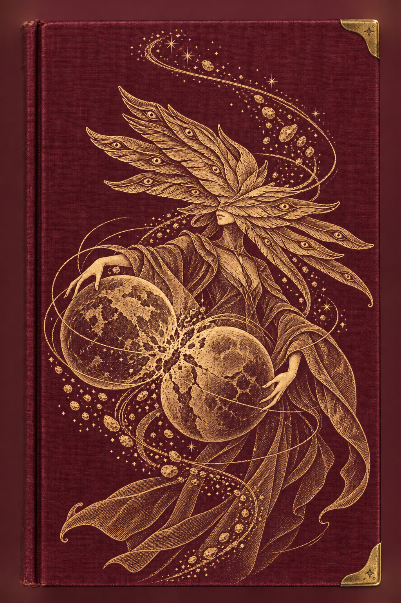
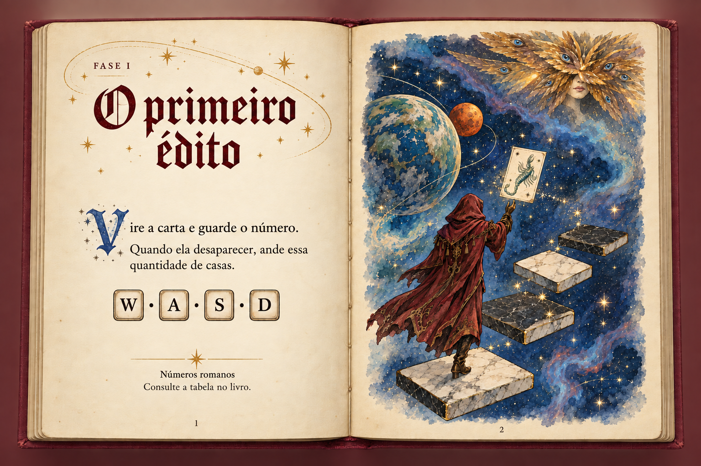
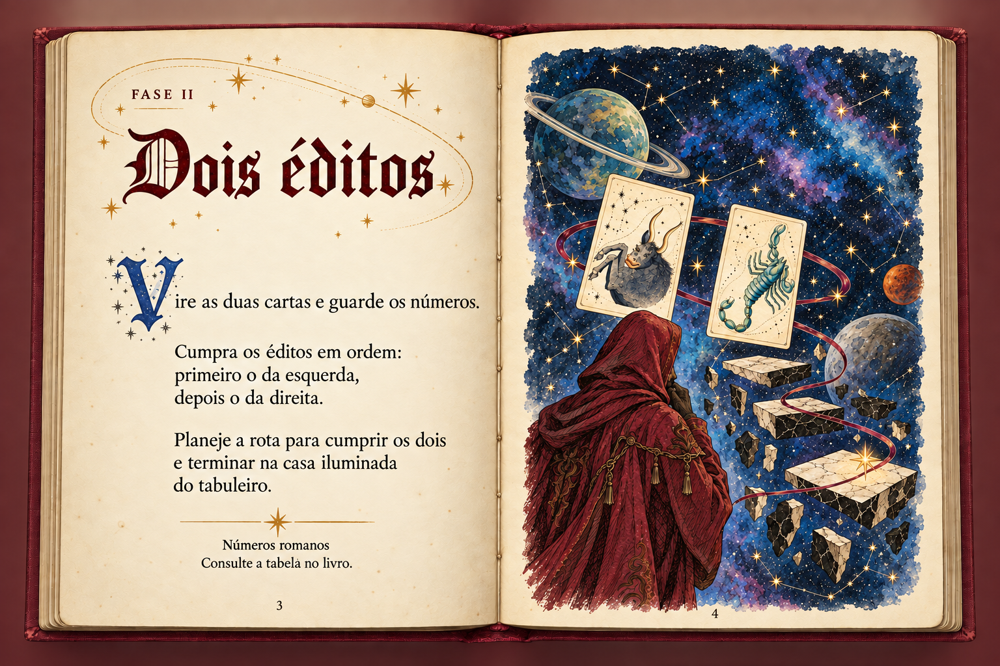
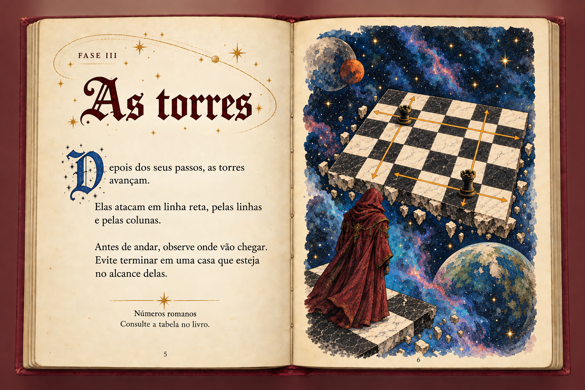
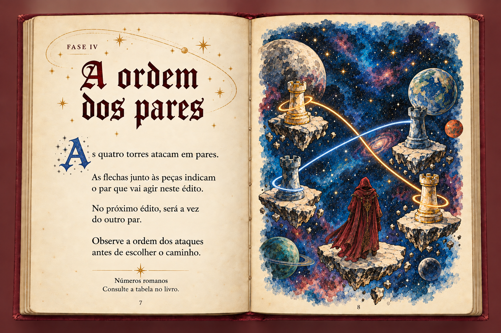
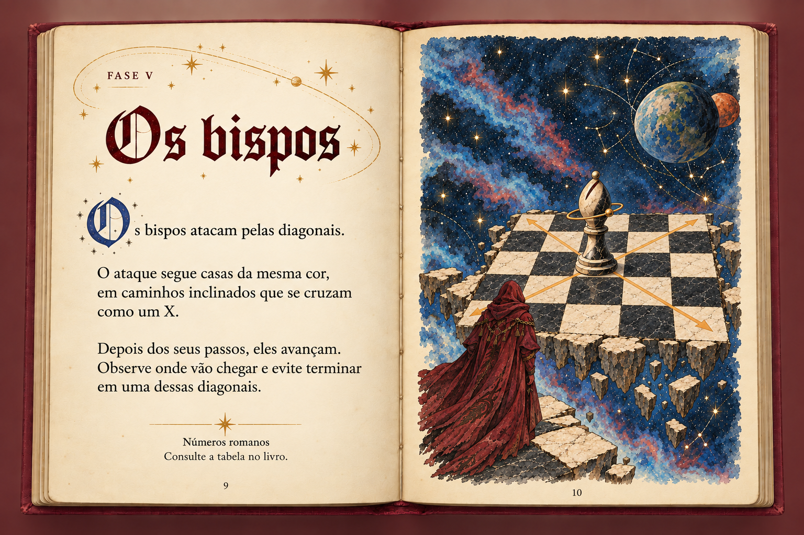
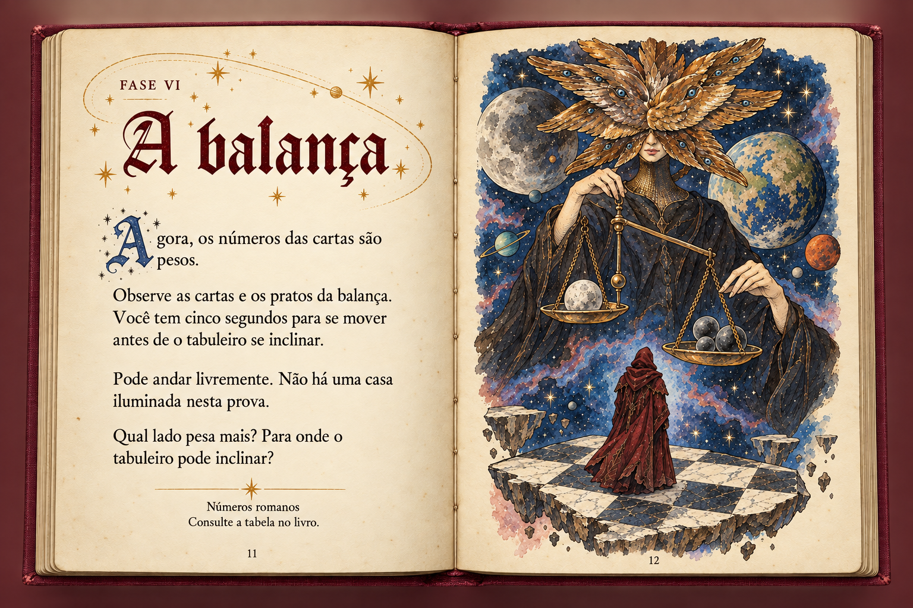
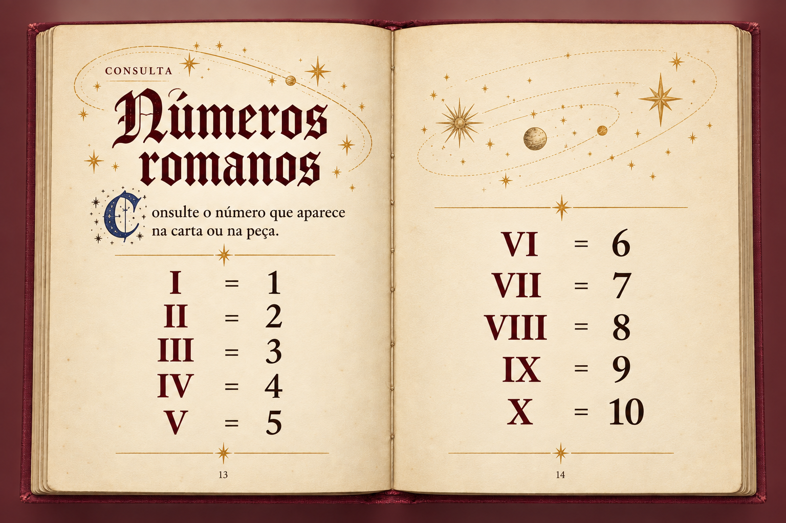

# Livro — páginas completas para avaliação

Propostas visuais geradas com a ferramenta integrada `image_gen.imagegen`. Não foram aplicadas ao jogo. Scripts, fontes, assets em uso e animações permanecem intactos. A pasta possui `.gdignore`.

A capa conserva tecido bordô e arte dourada, acrescentando somente duas cantoneiras à direita. A rainha permanece na capa, no primeiro édito e na balança; está ausente nas demais gravuras. A imagem do primeiro édito e a da balança foram preservadas como fontes, sem nova edição. Torres e bispo usam demonstrações de ataques alinhadas à malha, com casas de cores alternadas. As quatro torres têm uma ligação por par, entre peças da mesma cor.

As páginas mantêm título Old English, capitular azul, papel marfim e arte colorida a nanquim e aquarela. Foram retiradas as frases “Uma carta. Uma ordem.” e “Um passo por tecla.”; não foram acrescentados slogans às outras páginas.

## Arquivos finais

- [Capa com cantoneiras](cover_gold_corners.png)
- [Fase I — O primeiro édito](page_1_first_edict.png)
- [Fase II — Dois éditos](page_2_two_edicts.png)
- [Fase III — As torres](page_3_rooks.png)
- [Fase IV — A ordem dos pares](page_4_attack_order.png)
- [Fase V — Os bispos](page_5_bishops.png)
- [Fase VI — A balança](page_6_balance.png)
- [Consulta — Números romanos](page_7_numerals.png)
- [Todos os textos em formato editável](tutorial_texts.md)
- [Prompts e registro de geração](prompts.json)

## Capa

## Fase I

## Fase II

## Fase III

## Fase IV

## Fase V

## Fase VI

## Consulta

