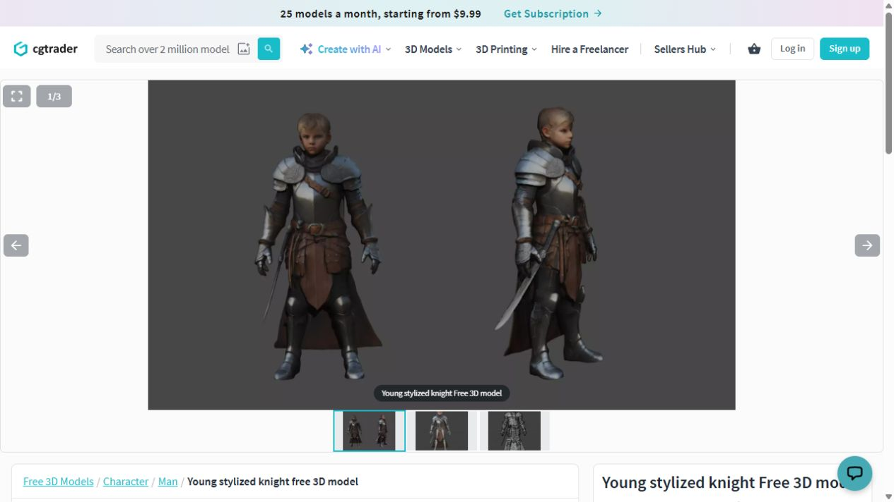
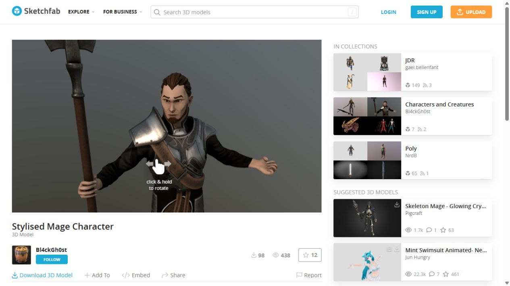
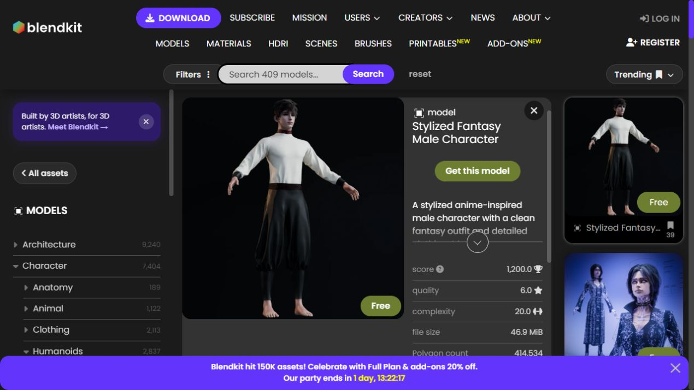

# Referências para o protagonista

Pesquisa em 30/09/2026. Os modelos abaixo aparecem como gratuitos nas páginas dos criadores. São candidatos para avaliação visual; o protagonista atual permanece instalado.

| Modelo | Perfil visual | Dados publicados | Pontos a conferir no arquivo |
| --- | --- | --- | --- |
| [Young stylized knight — HABO3D](https://www.cgtrader.com/free-3d-models/character/man/young-stylized-knight) | Rapaz loiro adolescente, rosto descoberto, armadura prateada e couro. É o candidato mais pronto para um primeiro teste. O autor descreve aproximadamente 14 anos. | Rig informado; FBX, glTF e Blender; cerca de 23 mil polígonos; licença Royalty Free (no AI). | Retarget das animações e organização de espada, capa e armadura. |
| [Stylised Mage Character — Bl4ckGh0st](https://sketchfab.com/3d-models/stylised-mage-character-94840f03b63946409f5d3318477259d5) | Adulto jovem, cabelo castanho e cavanhaque, roupa escura e armadura leve. O visual combina com a fantasia do jogo. | Texturas 2K; 70,3 mil triângulos; CC BY. | O anúncio apresenta uma pose e não confirma rig. Pode exigir rigging e preparo das mãos antes de usar as animações existentes. |
| [Stylized Fantasy Male Character — Krishna Hahs](https://www.blendkit.com/asset-gallery-detail/e3bbb0a4-c4f7-4a35-a00e-7a83f27a3f05/) | Jovem de aparência anime, camisa clara, calça ampla escura, sem armadura e descalço. Mais neutro quanto à classe do herói; botas e pequenos detalhes podem completar o visual. | Gratuito; licença Royalty free; 414.534 polígonos informados; arquivo 46,9 MiB. | Rig não confirmado. Avaliar redução de geometria, materiais e possibilidade de adicionar calçados. |

As licenças acima são as identificadas nos anúncios. No modelo CC BY, registrar autoria e alterações ao integrá-lo. A possibilidade de remover acessórios sem deixar buracos depende da organização da malha e será conferida no modelo escolhido.

As imagens são capturas dos previews originais, não mockups do personagem no jogo.

## Cavaleiro

## Mago

## Rapaz com roupa neutra

